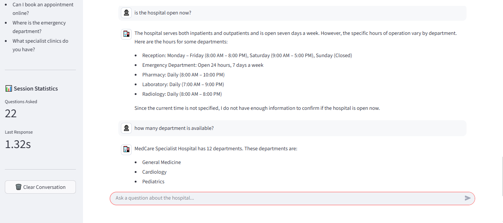

# 🏥 MedCare AI Assistant

> **An intelligent Retrieval-Augmented Generation (RAG) customer service chatbot for hospitals, powered by Groq, LangChain, FAISS, and Hugging Face Embeddings.**

<p align="center">


</p>

---

## Overview

**MedCare AI Assistant** is an AI-powered hospital customer service chatbot that provides accurate, context-aware responses by retrieving information from a hospital knowledge base instead of relying solely on a large language model.

Unlike traditional chatbots that may hallucinate or generate inaccurate information, this application uses **Retrieval-Augmented Generation (RAG)** to retrieve relevant documents from a vector database before generating each response.

The application is designed with a modular architecture and demonstrates practical implementation of modern Generative AI techniques suitable for healthcare customer support scenarios.

---

##  Key Features

-  AI-powered conversational hospital assistant
-  Retrieval-Augmented Generation (RAG)
-  FAISS vector database for semantic search
-  Hugging Face sentence embeddings
-  Groq Llama 3.1 for ultra-fast inference
-  Source citation for every response
-  Response time tracking
-  Modern Streamlit chat interface
-  Error handling and logging
-  Modular, production-inspired architecture

---

# 📸 Application Preview

## Home Page


---

## Chat Interaction



---

## Source Attribution


---

## System Architecture

The application follows a modular Retrieval-Augmented Generation (RAG) architecture.

```text
                         ┌─────────────────────────┐
                         │         User            │
                         └────────────┬────────────┘
                                      │
                                      ▼
                         ┌─────────────────────────┐
                         │   Streamlit Interface   │
                         └────────────┬────────────┘
                                      │
                                      ▼
                         ┌─────────────────────────┐
                         │   Session Management    │
                         └────────────┬────────────┘
                                      │
                                      ▼
                         ┌─────────────────────────┐
                         │      RAG Pipeline       │
                         └───────┬─────────┬───────┘
                                 │         │
                    Retrieve Docs│         │Generate Answer
                                 ▼         ▼
                    ┌─────────────────┐  ┌──────────────────┐
                    │ FAISS Vector DB │  │ Groq Llama 3.1   │
                    └────────┬────────┘  └────────┬─────────┘
                             │                    │
                             ▼                    │
                Hugging Face Embeddings           │
                             ▲                    │
                             │                    │
                  Hospital Knowledge Base ◄──────┘
```

### Workflow

1. The user submits a question through the Streamlit interface.
2. The question is converted into a vector embedding.
3. FAISS performs semantic similarity search.
4. The most relevant documents are retrieved.
5. Retrieved context is combined with the user question.
6. Groq's Llama 3.1 model generates a grounded response.
7. The chatbot returns:
   - The final answer
   - Source documents used
   - Response time

   ---

#  Technical Decisions

This project was designed to demonstrate practical implementation of a modern Retrieval-Augmented Generation (RAG) system while emphasizing modularity, maintainability, and production-inspired software engineering practices.

## Why Retrieval-Augmented Generation (RAG)?

Large Language Models are powerful but can produce inaccurate or fabricated responses (hallucinations). In healthcare-related customer support, providing reliable information is critical.

Using RAG allows the assistant to:

- Retrieve relevant information from a trusted hospital knowledge base.
- Generate responses grounded in retrieved documents.
- Provide source citations for improved transparency.
- Reduce hallucinations compared to a standalone LLM.

---

## Why Groq?

Several LLM providers were considered during development.

Groq was selected because it provides:

- Extremely fast inference speeds.
- A generous free developer tier.
- API compatibility similar to the OpenAI Python SDK.
- Access to powerful open-weight models such as **Llama 3.1**.

This made it an excellent choice for building a responsive portfolio application without introducing API costs.

---

## Why FAISS?

FAISS was selected as the vector database because it:

- Performs efficient similarity search.
- Is lightweight and easy to deploy locally.
- Integrates seamlessly with LangChain.
- Is widely adopted in modern RAG applications.

---

## Why Hugging Face Embeddings?

Instead of relying on paid embedding APIs, this project uses open-source sentence embedding models from Hugging Face.

Benefits include:

- No embedding API cost.
- Local embedding generation.
- High semantic search quality.
- Easy integration with LangChain.

---

## Why a Modular Architecture?

Instead of placing all logic inside a single application file, the project separates responsibilities into dedicated modules.

Examples include:

- Configuration management
- Logging
- Retrieval
- LLM integration
- RAG pipeline
- UI components
- Session management

This improves maintainability, readability, and scalability as the application grows.

---

#  Challenges & Lessons Learned

Building MedCare AI Assistant involved solving several real-world engineering challenges beyond simply integrating an LLM. These experiences strengthened my understanding of debugging, dependency management, and designing reliable AI applications.

## Challenge 1: OpenAI API Quota Limitations

### Problem
During development, the project initially used OpenAI for both embeddings and text generation. API quota limitations interrupted development and prevented further testing.

### Solution
I evaluated alternative providers and migrated the application to **Groq**, which offers a generous free developer tier while maintaining compatibility with the OpenAI-style API. This allowed development to continue with minimal code changes.

---

## Challenge 2: Python 3.14 Compatibility

### Problem
Several packages within the AI ecosystem had limited or delayed support for Python 3.14, resulting in installation conflicts and dependency resolution issues.

### Solution
Dependencies were carefully reviewed, compatible package versions were selected, and unnecessary packages were removed to create a stable development environment.

---

## Challenge 3: Embedding Model Integration

### Problem
Replacing OpenAI embeddings with Hugging Face embeddings introduced package compatibility issues and required updates to the retrieval pipeline.

### Solution
The embedding pipeline was successfully migrated to Hugging Face sentence-transformer models, eliminating embedding API costs while maintaining semantic search quality.

---

## Challenge 4: Streamlit Application Architecture

### Problem
As additional features such as logging, session management, source citations, and response timing were introduced, keeping all logic inside a single file would have made the application difficult to maintain.

### Solution
The project was refactored into a modular architecture with dedicated modules for configuration, retrieval, logging, LLM integration, UI components, and session management.

---

#  Lessons Learned

This project significantly improved my understanding of:

- Retrieval-Augmented Generation (RAG)
- Vector databases and semantic search
- Embedding models
- Prompt engineering
- LangChain integration
- Streamlit application architecture
- Error handling and logging
- Modular software design
- AI application deployment

---

#  Future Improvements

While the current version provides a complete Retrieval-Augmented Generation (RAG) chatbot experience, several enhancements could further improve the application:

-  Multi-turn conversational memory
-  Multi-language support
-  User authentication and role-based access
-  Admin dashboard for monitoring chatbot usage
-  User feedback and response rating system
-  Hybrid search (semantic + keyword search)
-  Appointment booking integration
-  Support for additional document formats (Word, Excel, HTML)
-  Cloud-based vector database (Pinecone, Weaviate, Chroma Cloud)
-  Fine-tuned healthcare language models

---

#  Installation

## 1. Clone the Repository

```bash
git clone https://github.com/Achese-creator/medcare-ai-assistant.git

cd medcare-ai-assistant
```

## 2. Create a Virtual Environment

```bash
python -m venv .venv
```

Activate it:

### Windows

```bash
.venv\Scripts\activate
```

### macOS/Linux

```bash
source .venv/bin/activate
```

---

## 3. Install Dependencies

```bash
pip install -r requirements.txt
```

---

## 4. Configure Environment Variables

Create a `.env` file.

Example:

```env
GROQ_API_KEY=your_groq_api_key
```

---

## 5. Build the Vector Database

```bash
python build_index.py
```

---

## 6. Launch the Application

```bash
streamlit run app.py
```

---

#  Example Questions

You can ask questions such as:

- What are your visiting hours?
- How do I book an appointment?
- Where is the emergency department?
- Do you accept insurance?
- What documents should I bring for my appointment?
- How can I contact the hospital?

---

#  Project Structure

```text
MedCare-AI-Assistant/
│
├── chatbot/              # Core RAG logic
├── knowledge_base/       # Hospital documents
├── logs/                 # Application logs
├── ui/                   # Streamlit UI components
├── vectorstore/          # FAISS index
│
├── app.py                # Streamlit entry point
├── build_index.py        # Builds FAISS index
├── requirements.txt
├── .gitignore
├── README.md
└── .env
```

---

#  Tech Stack

| Category | Technology |
|----------|------------|
| Language | Python |
| UI | Streamlit |
| LLM | Groq (Llama 3.1) |
| Framework | LangChain |
| Embeddings | Hugging Face Sentence Transformers |
| Vector Store | FAISS |
| Environment | Python Virtual Environment |

---

# ☁️ Deployment

The application can be deployed using **Streamlit Community Cloud**.

## Deploy Your Own

1. Fork or clone this repository.
2. Push it to your GitHub account.
3. Connect your repository to Streamlit Community Cloud.
4. Add the required environment variable:

```text
GROQ_API_KEY=your_api_key
```

5. Deploy the application.

---

# 🙏 Acknowledgements

This project was built using several outstanding open-source technologies:

- LangChain
- Streamlit
- FAISS
- Hugging Face
- Groq
- Python

Special thanks to the open-source community for providing the tools and resources that made this project possible.